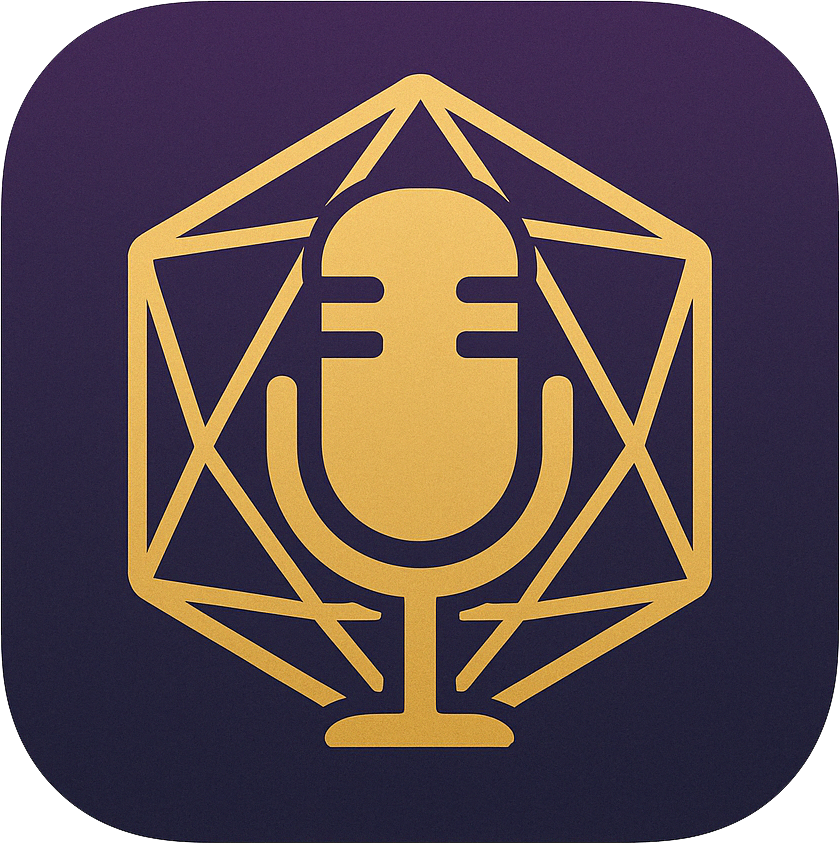

# TavernTapes



> A modern, accessible recording application designed specifically for Dungeons & Dragons sessions.

TavernTapes is the perfect companion for your D&D adventures, allowing you to record entire sessions with ease. Built with long-form recording in mind (6+ hours), it features comprehensive session management, high-quality audio capabilities, and a fantasy-inspired interface that prioritizes usability and accessibility.

## ✨ Features

### 🎙️ Recording Capabilities
- **Extended Recording Sessions** - Record for 6+ hours without interruption
- **Pause & Resume** - Take breaks without creating multiple files
- **High-Quality Audio** - WAV/MP3 formats with customizable quality settings
- **Automatic File Splitting** - Prevent large files with configurable time intervals
- **Input Device Selection** - Choose from available microphones
- **Crash Recovery** - Automatic recovery of interrupted recordings

### 📊 Session Management
- **Smart Organization** - Name, tag, and categorize your recorded adventures
- **Advanced Search** - Find sessions by name, tags, or notes with debounced search
- **Session Notes** - Add detailed notes to any recording session
- **Tagging System** - Organize sessions with custom tags
- **Export Functionality** - Export sessions with progress indicators
- **Persistent Storage** - Sessions stored locally with IndexedDB

### 🎨 User Experience
- **Accessibility First** - WCAG compliant with screen reader support
- **Keyboard Navigation** - Full keyboard accessibility throughout the app
- **Error Boundaries** - Graceful error handling and recovery
- **Performance Optimized** - React hooks and memoization for smooth operation
- **Modern Interface** - Clean, intuitive design with subtle fantasy elements
- **Responsive Design** - Optimized layouts for different screen sizes

### 🔧 Technical Features
- **TypeScript Support** - Full type safety throughout the application
- **Comprehensive Testing** - Component tests with Vitest and Testing Library
- **Input Validation** - Secure input handling and sanitization
- **Progressive Enhancement** - Works with and without JavaScript
- **Cross-Platform** - Electron-based desktop application

## 🚀 Getting Started

### Prerequisites

- Node.js (v18.0.0 or later)
- npm (comes with Node.js)
- Git

### Installation

1. Clone the repository
   ```bash
   git clone https://github.com/yourbr0ther/taverntapes.git
   cd taverntapes
   ```

2. Install dependencies
   ```bash
   npm install
   # or
   yarn install
   ```

3. Start the development server
   ```bash
   npm run electron:dev
   ```

### Building for Production

```bash
# Build the web application
npm run build

# Build the Electron application
npm run electron:build

# Run tests
npm test

# Run tests with coverage
npm run test:coverage
```

## 📖 Usage

### Recording a Session

1. Launch TavernTapes
2. Enter a session name (with input validation and sanitization)
3. Click the record button to begin recording
4. Use pause/resume as needed during breaks
5. Click stop when your session concludes
6. Your recording will be saved automatically with crash recovery

### Managing Sessions

**Sessions View Features:**
- Browse all recorded sessions with sorting by date
- **Search & Filter**: Real-time search with 300ms debouncing
- **Session Details**: View duration, format, quality, and file size
- **Notes Management**: Add, edit, and save session notes
- **Tagging System**: Add and remove tags for organization
- **Export**: Download sessions with progress indicators
- **Delete**: Remove sessions with confirmation dialogs
- **Keyboard Navigation**: Full accessibility support

**Accessibility Features:**
- Screen reader compatible with ARIA labels
- Keyboard navigation with Enter/Space key support
- Focus management and visual indicators
- Semantic HTML structure

### Settings

Access the settings panel to customize:
- **Audio Input**: Select from available microphones
- **Audio Format**: Choose between WAV and MP3
- **Audio Quality**: Set bitrate from 64-320 kbps
- **File Splitting**: Configure automatic splitting (1-120 minutes)
- **Storage Location**: Choose where recordings are saved
- **Real-time Validation**: All inputs are validated and sanitized

## 🏗️ Project Structure

```
taverntapes/
├── src/                     # Source files
│   ├── components/          # React UI components
│   │   ├── __tests__/       # Component tests (Vitest + Testing Library)
│   │   ├── dialogs/         # Dialog components
│   │   ├── layout/          # Layout components
│   │   ├── views/           # Main view components
│   │   ├── ErrorBoundary.tsx # Error boundary for graceful error handling
│   │   └── ProgressIndicator.tsx # Reusable progress component
│   ├── hooks/               # Custom React hooks
│   │   ├── useDebounce.ts   # Debouncing hook for search optimization
│   │   └── useSessionsReducer.ts # State management for sessions
│   ├── services/            # Core functionality services
│   │   ├── __tests__/       # Service tests
│   │   ├── AudioService.ts  # Audio recording and processing
│   │   ├── SessionService.ts # Session management with IndexedDB
│   │   ├── SettingsService.ts # User preferences
│   │   ├── FileSystemService.ts # File operations
│   │   └── CrashRecoveryService.ts # Recovery system
│   ├── types/               # TypeScript type definitions
│   │   ├── Session.ts       # Session-related interfaces
│   │   └── electron.d.ts    # Electron type definitions
│   ├── utils/               # Utility functions
│   │   ├── validation.ts    # Input validation and sanitization
│   │   └── timeUtils.ts     # Time formatting utilities
│   ├── main/                # Electron main process files
│   └── assets/              # Images, icons, and static assets
├── dist/                    # Build output directory
├── docs/                    # Documentation
│   ├── PLANNING.md          # Project planning document
│   ├── TASKS.md             # Development task list
│   └── DESIGN.md            # UI/UX design document
└── README.md                # This file
```

## 🧩 Technology Stack

### Frontend
- **React 18** - Modern UI library with hooks and concurrent features
- **TypeScript** - Full type safety and enhanced developer experience
- **Tailwind CSS** - Utility-first CSS framework with custom design system
- **React Router** - Client-side routing for single-page application

### Desktop Framework
- **Electron** - Cross-platform desktop application framework
- **Node.js** - Backend runtime for file operations and system integration

### Audio & Storage
- **RecordRTC** - WebRTC-based audio recording library
- **Web Audio API** - Native browser audio processing
- **IndexedDB** - Client-side database for session storage
- **File System API** - Local file operations

### Development & Testing
- **Vite** - Fast build tool and development server
- **Vitest** - Unit testing framework
- **Testing Library** - Component testing utilities
- **JSDoc** - Comprehensive code documentation

### Code Quality
- **ESLint** - Code linting and style enforcement
- **Performance Optimization** - useMemo, useCallback, and code splitting
- **Accessibility** - WCAG 2.1 AA compliance
- **Error Boundaries** - Graceful error handling and recovery

## 🗺️ Development Status

### ✅ Completed Features

**Core Functionality:**
- ✅ Audio recording with pause/resume
- ✅ Session management with full CRUD operations
- ✅ Crash recovery system with automatic state restoration
- ✅ File splitting and organization
- ✅ Audio quality settings (WAV/MP3, bitrate control)
- ✅ Input device selection

**User Experience:**
- ✅ Modern, accessible interface with WCAG 2.1 AA compliance
- ✅ Real-time search with debouncing (300ms)
- ✅ Session notes and tagging system
- ✅ Export functionality with progress indicators
- ✅ Keyboard navigation and screen reader support
- ✅ Error boundaries and graceful error handling

**Technical Excellence:**
- ✅ TypeScript throughout with strict type checking
- ✅ Comprehensive test suite (Vitest + Testing Library)
- ✅ Performance optimizations (useMemo, useCallback)
- ✅ Input validation and sanitization
- ✅ State management with useReducer patterns
- ✅ Custom hooks for reusable logic
- ✅ JSDoc documentation

**Code Quality:**
- ✅ Modern React patterns and hooks
- ✅ Clean architecture with service layer
- ✅ Error handling and retry logic
- ✅ Memory management and cleanup
- ✅ Security best practices

### 🎯 Production Ready
The application is feature-complete and production-ready with:
- Zero build errors or warnings
- Comprehensive error handling
- Full accessibility compliance
- Performance optimized
- Well-tested codebase
- Professional documentation

### 📋 Future Enhancements (Optional)
- Mobile application version
- Cloud backup integration
- AI transcription services integration
- Multi-track recording support
- Advanced audio processing filters
- Real-time collaboration features

## 🤝 Contributing

Contributions are welcome! Please feel free to submit a Pull Request.

1. Fork the repository
2. Create your feature branch (`git checkout -b feature/amazing-feature`)
3. Commit your changes (`git commit -m 'Add some amazing feature'`)
4. Push to the branch (`git push origin feature/amazing-feature`)
5. Open a Pull Request

### Development Guidelines

**Code Quality:**
- Follow existing TypeScript patterns and interfaces
- Write comprehensive tests for new features (Vitest + Testing Library)
- Use custom hooks for reusable logic
- Implement proper error boundaries and error handling
- Follow accessibility best practices (WCAG 2.1 AA)

**Performance:**
- Use useMemo and useCallback for optimization
- Implement debouncing for search and input operations
- Consider useReducer for complex state management
- Minimize re-renders with proper dependency arrays

**Architecture:**
- Keep components focused and under 300 lines
- Use the service layer pattern for business logic
- Implement proper input validation and sanitization
- Follow the established file structure and naming conventions
- Add JSDoc documentation for complex functions

**Testing:**
- Write unit tests for utilities and services
- Write component tests for UI interactions
- Test accessibility features (keyboard navigation, ARIA)
- Include error scenarios in test coverage

**Documentation:**
- Update README.md for significant changes
- Add JSDoc comments for public APIs
- Document accessibility considerations
- Update type definitions when needed

## 📄 License

This project is licensed under the MIT License - see the [LICENSE](LICENSE) file for details.

## 📞 Contact

YourBr0ther - [@YourBr0therr](https://twitter.com/yourbr0ther) - YourBr0ther.tv@gmail.com

Project Link: [https://github.com/YourBr0ther/taverntapes](https://github.com/YourBr0ther/taverntapes)
